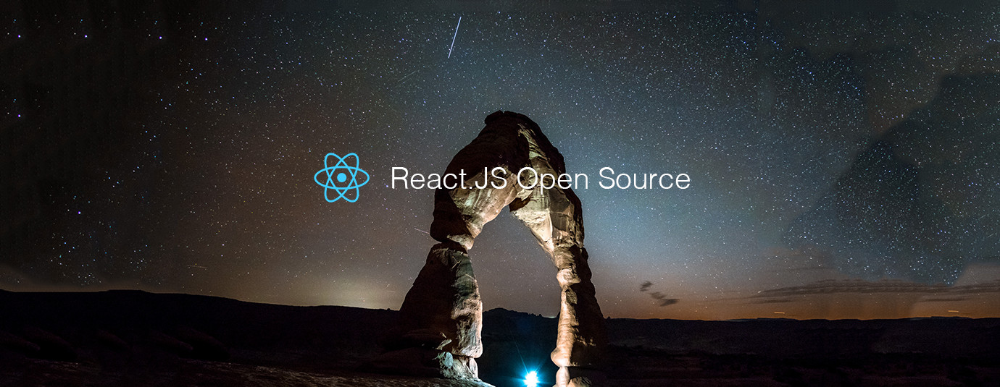

# React.js Top 10 Open Source Projects for the Past Month (v.Jun 2018)

</a>

For the past month, we ranked nearly 200 React.js Open Source Projects to pick the Top 10.
We compared projects with new or major release during this period. Mybridge AI ranks projects based on a variety of factors to measure its quality for professionals.

* Average number of Github stars in this edition: 5,426⭐️
* Topics: Router, Image Component, Desktop App, Material Design, React Native DOM, Animated Tree, Slack Clone, Admin Template, Components, App Manager

Open source projects can be useful for programmers. Hope you find an interesting project that inspires you.

 

### Course of the month:

[A) Beginners: React 16 — The Complete Guide (incl. React Router 4 & Redux)](http://bit.ly/2CKGqkt) [5,106 recommends, 4.8/5 stars]

[B) Advanced: Advanced React and Redux: 2018 Edition](http://bit.ly/2rffoiX) [5,927 recommends, 4.6/5 stars]

 

## Rank 1
### [React Router: Next Generation Routing for React [★2819]](https://github.com/reach/router?utm_source=mybridge&utm_medium=blog&utm_campaign=read_more)

 

## Rank 2
### [React-ideal-image: An Almost Ideal React Image Component  [★1978]](https://github.com/stereobooster/react-ideal-image?utm_source=mybridge&utm_medium=blog&utm_campaign=read_more)

 

## Rank 3
### [Proton-native: A React environment for cross platform native desktop apps [★7368]](https://github.com/kusti8/proton-native?utm_source=mybridge&utm_medium=blog&utm_campaign=read_more)

 

## Rank 4
### [Material-ui v1.0: React components that implement Google's Material Design. [★37805]](https://github.com/mui-org/material-ui/releases/tag/v1.0.0?utm_source=mybridge&utm_medium=blog&utm_campaign=read_more)

 

## Rank 5
### [React-native-dom: An experimental, comprehensive port of React Native to the web. [★2434]](https://github.com/vincentriemer/react-native-dom?utm_source=mybridge&utm_medium=blog&utm_campaign=read_more)

 

## Rank 6
### [React-animated-tree: Simple to use, configurable tree view with full support for drop-in animations [★500]](https://github.com/drcmda/react-animated-tree?utm_source=mybridge&utm_medium=blog&utm_campaign=read_more)

 

## Rank 7
### [React-slack-clone: Complete chat application, built with Chatkit [★692]](https://github.com/pusher/react-slack-clone?utm_source=mybridge&utm_medium=blog&utm_campaign=read_more)

 

## Rank 8
### [React-reduction: React Reduction: Free Admin Template Built with React and Bootstrap4 [★285]](https://github.com/reduction-admin/react-reduction?utm_source=mybridge&utm_medium=blog&utm_campaign=read_more)

 

## Rank 9
### [Kit: Tools for developing, documenting, and testing React component libraries [★859]](https://github.com/c8r/kit?utm_source=mybridge&utm_medium=blog&utm_campaign=read_more)

 

## Rank 10
### [Ram: React Application Manager: create and run React (and other) applications – no command line or build setup required [★489]](https://github.com/jxnblk/ram?utm_source=mybridge&utm_medium=blog&utm_campaign=read_more)

                    
