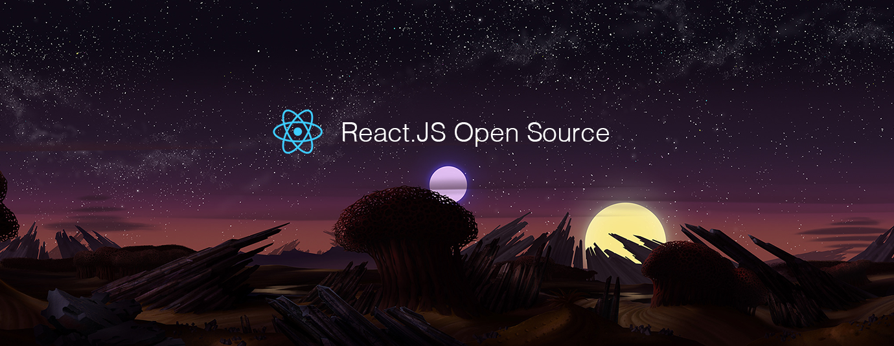

# React.js Open Source of the Month (v.Sep 2018)

</a>

For the past month, we ranked nearly 200 React.js Open Source Projects to pick the Top 10.
We compared projects with new or major release during this period. Mybridge AI ranks projects based on a variety of factors to measure its quality for professionals.

* Average number of Github stars in this edition: 1,113⭐️
* Topics: UI Development, Scrolling, Zooming, Prototyping, Music streaming, Effect Buttons, Manage state, Toast, React Native, Circuit UI, Web Worker

Open source projects can be useful for programmers. Hope you find an interesting project that inspires you.

 

### Course of the month:

Course of the month:

[A) Beginners: The Complete React Web Developer Course (with Redux).](http://bit.ly/2mM28xA)[7,378 recommends, 4.7/5 stars]

[B) Advanced: Build an app with React, Redux and Firestore from scratch.](http://bit.ly/2N51QNL)[1,751 recommends, 4.7/5 stars]

                      
 

## Rank 1
### [Reach-ui: he Accessible Foundation for React Apps and Design Systems. [★1000]](https://github.com/reach/reach-ui?utm_source=mybridge&utm_medium=blog&utm_campaign=read_more)

 

## Rank 2
### [Code-surfer: React component for scrolling, zooming and highlighting code samples [★1902]](https://github.com/pomber/code-surfer?utm_source=mybridge&utm_medium=blog&utm_campaign=read_more)

 

## Rank 3
### [React-proto: React application prototyping tool for developers and designers. [★1366]](https://github.com/React-Proto/react-proto?utm_source=mybridge&utm_medium=blog&utm_campaign=read_more)

 

## Rank 4
### [Apple-music-js: A music streaming service created from the ground up using ReactJS & Redux [★1208]](https://github.com/tvillarete/apple-music-js?utm_source=mybridge&utm_medium=blog&utm_campaign=read_more)

 

## Rank 5
### [React-particle-effect-button: Bursting particle effect buttons for React [★985]](https://github.com/transitive-bullshit/react-particle-effect-button?utm_source=mybridge&utm_medium=blog&utm_campaign=read_more)

 

## Rank 6
### [Reworm: the simplest way to manage state! [★1114]](https://github.com/pedronauck/reworm?utm_source=mybridge&utm_medium=blog&utm_campaign=read_more)

 

## Rank 7
### [React-toast-notifications: A toast notification system for react [★275]](https://github.com/jossmac/react-toast-notifications?utm_source=mybridge&utm_medium=blog&utm_campaign=read_more)

 

## Rank 8
### [WatermelonDB: Next-gen database for powerful React and React Native apps that scales to 10,000s of records and remains fast [★2930]](https://github.com/Nozbe/WatermelonDB?utm_source=mybridge&utm_medium=blog&utm_campaign=read_more)

 

## Rank 9
### [Circuit-ui: React component library for sumup web apps [★194]](https://github.com/sumup/circuit-ui?utm_source=mybridge&utm_medium=blog&utm_campaign=read_more)

 

## Rank 10
### [React-webworker: Communicate with a Web Worker from React [★277]](https://github.com/ghengeveld/react-webworker?utm_source=mybridge&utm_medium=blog&utm_campaign=read_more)

                    
