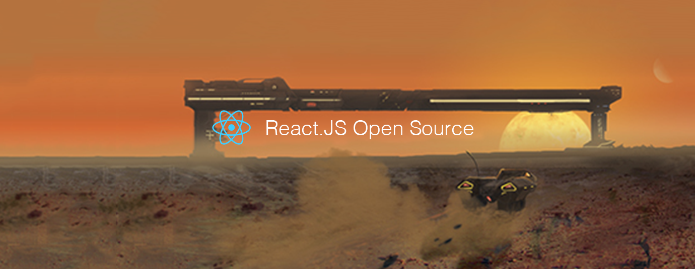

# React.js Open Source of the Month (v.Nov 2018)

</a>

For the past month, we ranked nearly 200 React.js Open Source Projects to pick the Top 10.
We compared projects with new or major release during this period. Mybridge AI ranks projects based on a variety of factors to measure its quality for professionals.

* Average number of Github stars in this edition: 998 ⭐️
* Topics: Web Components, Babel Plugin, GraphQL, Global State, UI Controls, Hooks API, Design Systems, Mobx, Vscode

Open source projects can be useful for programmers. Hope you find an interesting project that inspires you.

 

### Course of the month:

Course of the month:

[A) Beginners: Node with React: Fullstack Web Development.](http://bit.ly/2EQfnEN) [6,831 recommends, 4.6/5 stars]

[B) Advanced React and Redux: 2018 Edition.](http://bit.ly/2rffoiX) [7,012 recommends, 4.7/5 stars]

 

## Rank 1
### [The-platform: Web API's turned into React Hooks and Suspense-friendly React components. [★3084]](https://github.com/palmerhq/the-platform?utm_source=mybridge&utm_medium=blog&utm_campaign=read_more)

 

## Rank 2
### [Rawact: A babel plugin which compiles React.js components into native DOM instructions to eliminate the need for the react library at runtime. [★2132]](https://github.com/sokra/rawact?utm_source=mybridge&utm_medium=blog&utm_campaign=read_more)

 

## Rank 3
### [Graphpack: A minimalistic zero-config GraphQL server. [★1462]](https://github.com/glennreyes/graphpack?utm_source=mybridge&utm_medium=blog&utm_campaign=read_more)

 

## Rank 4
### [Easy-peasy: Easy peasy global state for React [★599]](https://github.com/ctrlplusb/easy-peasy?utm_source=mybridge&utm_medium=blog&utm_campaign=read_more)

 

## Rank 5
### [Retoggle:  UI controls as React Hooks to control your component state from outside [★928]](https://github.com/Raathigesh/retoggle?utm_source=mybridge&utm_medium=blog&utm_campaign=read_more)

 

## Rank 6
### [Haunted: React's Hooks API implemented for web components  [★627]](https://github.com/matthewp/haunted?utm_source=mybridge&utm_medium=blog&utm_campaign=read_more)

 

## Rank 7
### [Graphqldesigner.com: A developer web-app tool to rapidly prototype a full stack implementation of GraphQL with React. [★261]](https://github.com/GraphQL-Designer/graphqldesigner.com?utm_source=mybridge&utm_medium=blog&utm_campaign=read_more)

 

## Rank 8
### [Playroom: Design with JSX, powered by your own component library. [★468]](https://github.com/seek-oss/playroom?utm_source=mybridge&utm_medium=blog&utm_campaign=read_more)

 

## Rank 9
### [Mobx-react-lite: Lightweight React bindings for MobX based on experimental React hooks [★169]](https://github.com/mobxjs/mobx-react-lite?utm_source=mybridge&utm_medium=blog&utm_campaign=read_more)

 

## Rank 10
### [Vscode-glean: The extension provides refactoring tools for your React codebase [★427]](https://github.com/wix/vscode-glean?utm_source=mybridge&utm_medium=blog&utm_campaign=read_more)

                    
